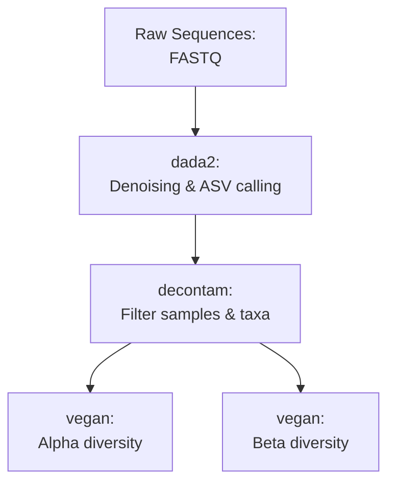

# Cali Soil Microbiome Projects

## Stim Regen

The current pipeline is as follows

```mermaid
graph TB;
    A[Raw Sequences: \nFASTQ] --> B[dada2: \nDenoising & ASV calling];
    B --> C[decontam: \nFilter samples & taxa];
    C --> D[vegan: \nAlpha diversity];
    C --> E[vegan: \nBeta diversity];
```

